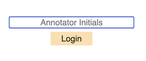
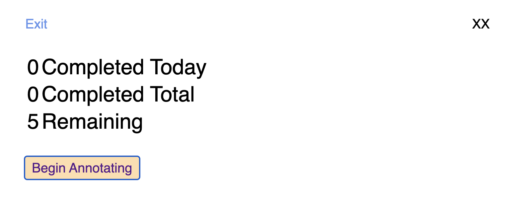
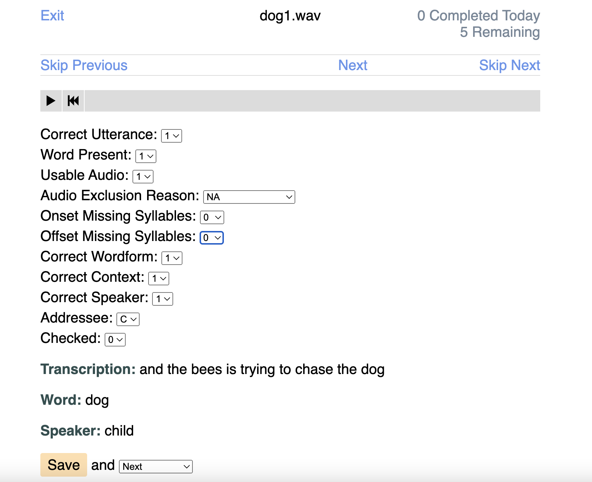
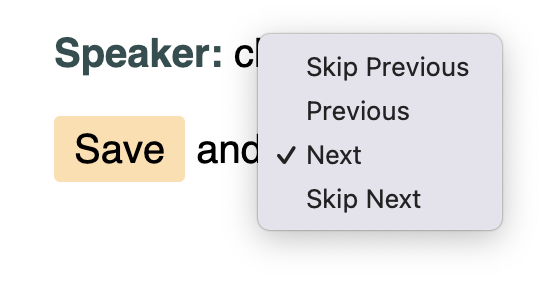

# Annotate (Anotar) - Multiple Choice

Annotate (Anotar) - Multiple Choice is an application for efficiently eliciting categorical annotations (from predefined options) for short audio files. For text-based annotations, see [https://github.com/marisacasillas/annotate-app/]().

The application is run through local server, meaning that audio playback and annotations are done in your web browser, but using files that stored on your local machine. To do this, the app relies on Python, your web browser (we recommend Chrome), and the Howler audio library. All file storage is local. Therefore, the Annotate application can be used for offline projects (e.g., in 'the field') and projects with strict data privacy policies.

Once a batch of annotation is initiated and the application is up and running (see [Getting started](#getting-started) below), annotators can log in, add annotations, track their progress, log out when ready for a break, and repeat when they're ready to begin again. Some features of the application include:

* **Required user login:** Each annotation is time-stamped and associated with a particular user. This features is useful for tracking sources of between-annotator variability and for checking that work is being divided as planned. By default, Annotate expects 2- or 3-letter initials, but you can edit the set of allowable usernames (`USERS`) in `annotate-app/annotate/config.py`.

<p align="center">
 <br/>
  <i>Figure 1.</i> Log in screen
</p>

* **Progress updates:** Users are reminded of how many annotations they have completed on a given day, how many they annotations they have completed overall for the current set, and how files are left to annotate. This information can help motivate users to keep annotating and can also aid consistent annotation progress from one work session to the next.

<p align="center">
 <br/>
  <i>Figure 2.</i> Example progresss update for annotator "XX"
</p>

* **Keyboard inputs:** Most interaction with the application can be done purely from keyboard input. This feature significantly speeds up text entry and audio playback. See [Key commands](#key-commands) for a list of default key commands, which can be edited directly in `annotate-app/static/script/app.js`.

* **Default annotation values:** For efficient annotation, default values can be set in `annotate/database.py`. 

<p align="center">
 <br/>
  <i>Figure 3.</i> Example annotation screen for the audio file "dog1.wav"
</p>

* **Save and set mode options:** Users can save their annotations for the current clip and determine which clip to play next by setting the mode.

<p align="center">
 <br/>
  <i>Figure 4.</i> Save modes
</p>

* **Backward navigation/re-annotation:** Users can re-visit and edit their entries for audio clips they have already annotated. This is useful when further context might clarify the content of an audio file recently heard.

## Getting started

**Install the annotate-app**

```sh
# Install pipenv, which we use for dependency management, globally
pip3 install pipenv # may need sudo
# Clone the application
git clone https://github.com/marisacasillas/annotate-app.git
cd annotate-app
# Switch to the multiple-choice branch
git switch multiple-choice
# Install dependencies
pipenv install
```

**Copy the batch of audio clips you want to annotate into `annotate-app/static/snippets/`**

```sh
# Copy some sound files to annotate into static/snippets
cp YOUR_FILES_HERE static/snippets/
```

Make sure the directory _only_ contains sound files that you want to annotate.

**Initialize the database of audio clip annotations**

```sh
# Create the database for the snippets
# Replace "transcriptions.example.csv" with your file name
pipenv run ./make-database.py transcriptions.example.csv
```
Note that, if you are preparing your second batch, you have to remove the old database file first (`rm var/database.db`)

**Start up the application**

```sh
# Run the application (starts a local web server)
pipenv run ./app.py
```
Note that this command needs to be run again if the host computer is rebooted.

**Begin annotating**

Point your browser at [`http://localhost:8080/login`](). Log in with your initials, listen to the audio clip, and enter your responses.

**Inspect the annotations**

Annotations are stored in a database file in `annotate-app/var/`. Use the `db2csv.py` script to convert this file into a CSV and then inspect as you normally would (in R, Excel, etc.). We recommend using a file name that reflects the date and time of your file conversion.

```sh
# Convert the current database file into a CSV
./db2csv.py
# The CSV will be written with a timestamped name to the annotate-app directory
```

## Key commands
Playback begins automatically and can be controlled with the `/` and `←` keys. To speed up annotation, users can simply click on the keys associated with each variable to shift the focus (e.g., pressing `u` will bring them directly to the usable audio dropdown). From there, they can press the first character of the value you want to mark (e.g., `n` for "Noise-Other") to automatically code without clicking the dropdown options directly. 

| key | toggle | input options | default annotation value |
| --- | --- | --- | --- |
| `/` | play or pause | - | - |
| `←` | restart audio playback | - | - |
| `↵` | save current annotation | - | - |
| `t` | correct u**t**terance | 0 / 1 |
| `p` | word **p**resent | 0 / 1 | 1 |
| `u` | **u**sable audio | 0 / 1 | 1 |
| `e` |  audio **e**xclusion reason | Microphone / Outside/ Noise-Other / Speech /  Extra / NA | NA |
| `n` | o**n**set missing syllables| 0 / 1- / 2- / 3- / 4- / +  / S | 0 |
| `f` | o**f**fset missing syllables | 0 / 1- / 2- / 3- / 4- / + / S | 0 |
| `w` | correct **w**ordform | 0 / 1 | 1 |
| `x` | correct conte**x**t | 0 / 1 | 1 |
| `s` | correct **s**peaker | 0 / 1 | 1 |
| `a` | **a**ddressee | C / O | C |
| `c` | **c**hecked | 0 / 1 | 0 |

## Language settings
[to be filled in!]

## Desktop use
[to be filled in!]

## Authorship and conditions of use
This application was authored and designed by Shawn Cameron Tice (author, creator) and Marisa Casillas (creator). We support the open re-use of code, and hereby distribute this project under the [GNU General Public License v3.0](https://choosealicense.com/licenses/gpl-3.0/), which requires that any work using modifications of this source code must be made available to the public using the same license (see `annotate-app/LICENSE.txt` for details).

If you would like to cite this project in your work, please refer to the project's home on GitHub ([https://github.com/marisacasillas/annotate-app]()). Please raise issues, contribute improvements, and leave other comments or suggestions regarding this project on its GitHub repository.
